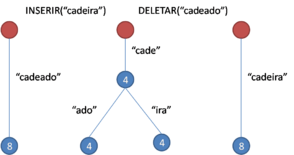

# TAD-Trie

## Introdução

A **Trie** , também conhecida como **árvore prefixada**, é uma estrutura de dados que se parece com uma árvore de busca binária, geralmente utilizada para implementar dicionários e fazer pesquisa em textos. Os elementos em uma Trie são chamados nó.

## Características Principais

- Cada nó representa um caractere.
- As palavras são formadas ao percorrer os caminhos da raiz até os nós folha.
- Permite busca eficiente de palavras e prefixos.


---

## Implementação de uma Trie em JavaScript

### Passo 1: Criando a Classe `TrieNode`

Cada nó da Trie contém:
- Um objeto para armazenar os filhos.
- Um booleano indicando se é o fim de uma palavra.

```javascript
class TrieNode {
    constructor() {
        this.children = {};
        this.isEndOfWord = false;
    }
}
```

---

### Passo 2: Criando a Classe `Trie`

A classe `Trie` irá conter os seguintes métodos:
- `insert(word)`: Insere uma palavra na Trie.
- `search(word)`: Verifica se uma palavra está presente.
- `startsWith(prefix)`: Verifica se existe alguma palavra que comece com um determinado prefixo.

```javascript
class Trie {
    constructor() {
        this.root = new TrieNode();
    }
    
    insert(word) {
        let node = this.root;
        for (let char of word) {
            if (!node.children[char]) {
                node.children[char] = new TrieNode();
            }
            node = node.children[char];
        }
        node.isEndOfWord = true;
    }
    
    search(word) {
        let node = this.root;
        for (let char of word) {
            if (!node.children[char]) {
                return false;
            }
            node = node.children[char];
        }
        return node.isEndOfWord;
    }
    
    startsWith(prefix) {
        let node = this.root;
        for (let char of prefix) {
            if (!node.children[char]) {
                return false;
            }
            node = node.children[char];
        }
        return true;
    }
}
```

---

## Testando a Trie

```javascript

// Criando uma Trie
const trie = new Trie();

// Inserindo palavras na trie
trie.insert("cachorro");
trie.insert("boliche");
trie.insert("carro");

// Testando o método de buscar de palavras (search) e o método de inicia com (startsWith)
console.log(trie.search("cachorro")); // true
console.log(trie.search("cachoro")); // false
console.log(trie.startsWith("cach")); // true
console.log(trie.startsWith("cac")); // true
console.log(trie.startsWith("caro")); // false
```


## Imagem Ilustrativa do funcionamento de uma Trie

<!--  -->


## Conclusão

A Trie é uma estrutura poderosa para manipulação de strings e pode ser utilizada em várias aplicações como busca preditiva, correção ortográfica e compressão de dados. A implementação apresentada fornece uma base sólida para futuros aprimoramentos, como armazenar contagens de palavras e remover palavras da Trie.